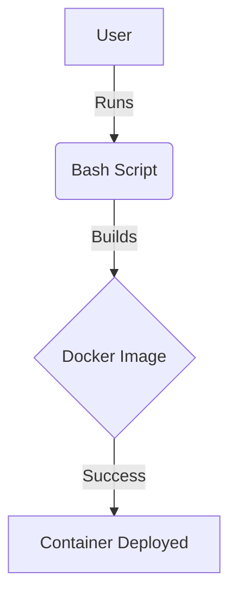

## Setup Test Page

The Complete DevOps Lab Structure

```txt
devops-lab/
├── .github/workflows/
│   └── main.yml        <-- Automated CI/CD
├── .vscode/
│   ├── extensions.json
│   └── settings.json
├── .env                <-- Local secrets (Gitignored)
├── .env.example        <-- Template for others
├── .gitignore          <-- Your security guard
├── .gitattributes      <-- Added to lock in LF
├── Dockerfile          <-- Multi-stage build
├── docker-compose.yml  <-- The Orchestrator
├── nginx.conf          <-- Server rules
├── index.php           <-- The App
├── test-script.sh      <-- Automation logic
└── README.md           <-- Documentation
```

### Architecture Flow


### ✅ How to verify the "Magic"
1.  **Icons:** Look at your file tree on the left. You should see a **Shell icon** for the `.sh` file, a **Whale icon** for the `Dockerfile`, and a **Markdown icon** for the `.md` file.
2.  **Format on Save:** In the `Dockerfile`, put 5 spaces between `FROM` and `alpine`. Hit `Ctrl + S`. It should automatically shrink back to 1 space.
3.  **Terminal:** Press ``Ctrl + ` ``. It should open **Git Bash** (or your chosen shell) instead of the standard Windows Command Prompt.

> [!NOTE]
> This is a helpful note to keep users on track.

> [!TIP]
> Use the `dcrebuild` alias we created to save time!

> [!IMPORTANT]
> Don't forget to set your variables in the .env file.

> [!WARNING]
> Never commit your actual .env file to Git!

> [!CAUTION]
> Deleting the docker volume will wipe your local database.

## Reference
- https://gemini.google.com/share/7157aa4af76e
  