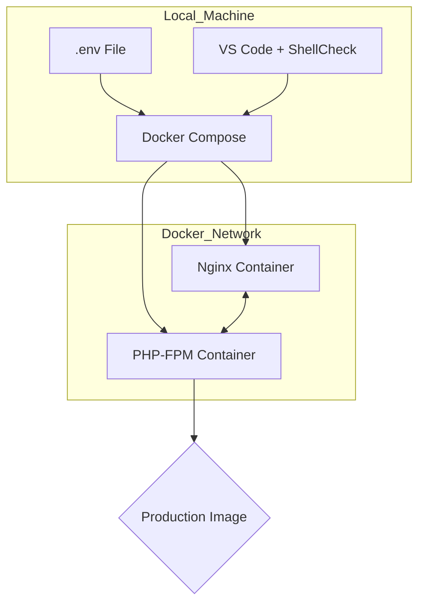
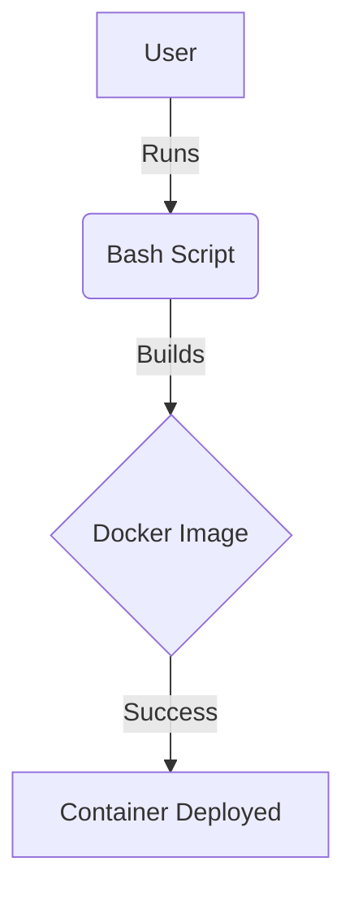

## Setup Test Page

# 🚀 DevOps Lab: PHP-Docker Environment


A professional-grade development environment optimized for **VS Code**, featuring multi-stage Docker builds, Nginx orchestration, and automated CI/CD via GitHub Actions.

---

## 🏗 System Architecture


This lab uses a decoupled architecture to ensure high performance and environment parity between local development and production.



```txt
devops-lab/
├── .github/workflows/
│   └── main.yml        <-- Automated CI/CD
├── .vscode/
│   ├── extensions.json
│   └── settings.json
├── .env                <-- Local secrets (Gitignored)
├── .env.example        <-- Template for others
├── .gitignore          <-- Your security guard
├── .gitattributes      <-- Added to lock in LF
├── Dockerfile          <-- Multi-stage build
├── docker-compose.yml  <-- The Orchestrator
├── nginx.conf          <-- Server rules
├── index.php           <-- The App
├── test-script.sh      <-- Automation logic
└── README.md           <-- Documentation
```

### Architecture Flow


### ✅ How to verify the "Magic"
1.  **Icons:** Look at your file tree on the left. You should see a **Shell icon** for the `.sh` file, a **Whale icon** for the `Dockerfile`, and a **Markdown icon** for the `.md` file.
2.  **Format on Save:** In the `Dockerfile`, put 5 spaces between `FROM` and `alpine`. Hit `Ctrl + S`. It should automatically shrink back to 1 space.
3.  **Terminal:** Press ``Ctrl + ` ``. It should open **Git Bash** (or your chosen shell) instead of the standard Windows Command Prompt.

> [!NOTE]
> This is a helpful note to keep users on track.

> [!TIP]
> Use the `dcrebuild` alias we created to save time!

> [!IMPORTANT]
> Don't forget to set your variables in the .env file.

> [!WARNING]
> Never commit your actual .env file to Git!

> [!CAUTION]
> Deleting the docker volume will wipe your local database.

## Reference
- https://gemini.google.com/share/7157aa4af76e
  


This `README.md` is designed to be the "source of truth" for your lab. It utilizes the **GitHub-native Alerts**, **Mermaid diagrams**, and **shields** we discussed to make it look like a high-tier professional repository.

Copy the content below into your `README.md` file:

---


# 🚀 DevOps Lab: PHP-Docker Environment


A professional-grade development environment optimized for **VS Code**, featuring multi-stage Docker builds, Nginx orchestration, and automated CI/CD via GitHub Actions.

---

## 🏗 System Architecture


This lab uses a decoupled architecture to ensure high performance and environment parity between local development and production.


---

## 🛠 Features

* **Multi-Stage Dockerfile:** Optimized for size and security using `alpine` builds.
* **Git Attributes:** Automatic `LF` line-ending enforcement for Windows/Linux compatibility.
* **Bash Aliases:** Pre-configured shortcuts for Docker and system management.
* **GitHub Actions:** Automated linting for Bash and PHP on every push.

---

## 🚦 Getting Started

### 1. Configure Environment

Clone the repo and initialize your secrets:

```bash
cp .env.example .env

```

> [!WARNING]
> Never commit your `.env` file. It is already added to `.gitignore`, but stay vigilant!

### 2. Launch the Stack

Use the custom alias or the standard command:

```bash
# Using the alias we set up:
dcrebuild

# Or standard command:
docker compose up -d --build

```

### 3. Verification

Visit `http://localhost:8080` in your browser. You should see the PHP info page rendered by Nginx.

---

## 💻 VS Code Optimization

This project includes a `.vscode` folder that configures your editor automatically.

> [!IMPORTANT]
> When you open this folder, click **"Install"** on the "Recommended Extensions" popup to enable ShellCheck, Mermaid diagrams, and Docker IntelliSense.

### Helpful Aliases

| Alias       | Command                        | Description         |
| ----------- | ------------------------------ | ------------------- |
| `dcup`      | `docker compose up -d`         | Start containers    |
| `dcrebuild` | `docker compose up -d --build` | Rebuild and restart |
| `dclog`     | `docker compose logs -f`       | Tail container logs |
| `checksh`   | `shellcheck *.sh`              | Lint your scripts   |

---

## 📝 Maintenance

### Line Endings

This project requires `LF` line endings. If you see errors running scripts:

1. Check the status bar in VS Code (bottom right).
2. Ensure it says **LF**, not **CRLF**.

---

## 📄 License

This project is licensed under the MIT License - see the LICENSE file for details.

---

### 💡 Pro-Tip: Adding the Badges
The "Badges" at the top are currently static placeholders. Once you push this to a real GitHub repository, you can replace the "Build Status" URL with your actual GitHub Actions badge URL:

1. Go to your **GitHub Repo** > **Actions**.
2. Click on your **CI/CD Pipeline** workflow.
3. Click the **"..."** menu > **Create status badge**.
4. Copy the Markdown link and replace my placeholder!
