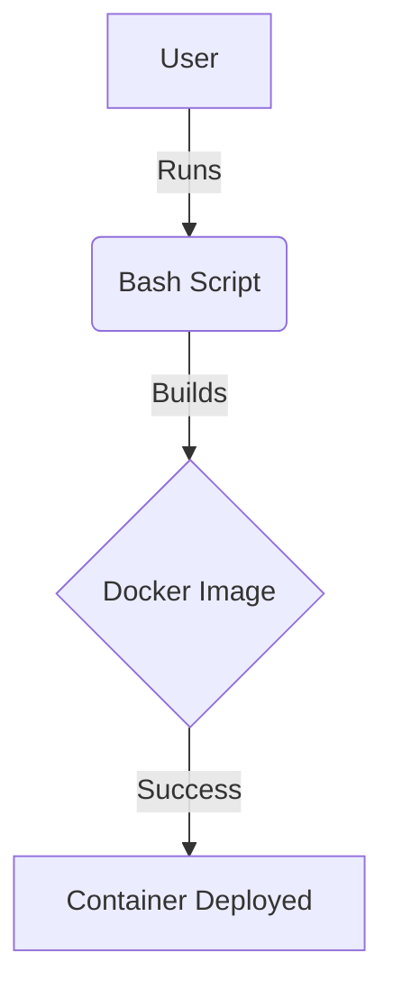

# Setup Test Page

The Complete DevOps Lab Structure

```txt
devops-lab/
├── .vscode/
│   ├── extensions.json
│   └── settings.json
├── .env                <-- Your secrets
├── .gitignore          <-- Your shield
├── Dockerfile          <-- Your blueprint
├── docker-compose.yml  <-- Your conductor
├── test-script.sh      <-- Your logic
└── README.md           <-- Your map
```

```txt
devops-lab/
├── .vscode/            <-- Config & Extensions
├── .env                <-- Your Variables
├── .gitignore          <-- Your Security
├── Dockerfile          <-- Build Instructions
├── docker-compose.yml  <-- Orchestration
├── nginx.conf          <-- Nginx Server Config
├── .htaccess           <-- Apache Server Config
├── index.php           <-- Application Code
├── test-script.sh      <-- Automation Logic
└── README.md           <-- Project Map
```

```txt
devops-lab/
├── .github/workflows/
│   └── main.yml        <-- Automated CI/CD
├── .vscode/
│   ├── extensions.json
│   └── settings.json
├── .env                <-- Local secrets (Gitignored)
├── .env.example        <-- Template for others
├── .gitignore          <-- Your security guard
├── Dockerfile          <-- Multi-stage build
├── docker-compose.yml  <-- The Orchestrator
├── nginx.conf          <-- Server rules
├── index.php           <-- The App
├── test-script.sh      <-- Automation logic
└── README.md           <-- Documentation
```

!!! note "Verification"
    If you see this in a blue or styled box, Admonitions are working.

### Architecture Flow


### ✅ How to verify the "Magic"
1.  **Icons:** Look at your file tree on the left. You should see a **Shell icon** for the `.sh` file, a **Whale icon** for the `Dockerfile`, and a **Markdown icon** for the `.md` file.
2.  **Format on Save:** In the `Dockerfile`, put 5 spaces between `FROM` and `alpine`. Hit `Ctrl + S`. It should automatically shrink back to 1 space.
3.  **Terminal:** Press ``Ctrl + ` ``. It should open **Git Bash** (or your chosen shell) instead of the standard Windows Command Prompt.

**Does the Mermaid diagram render correctly in your preview window, or do you see the raw code?**
